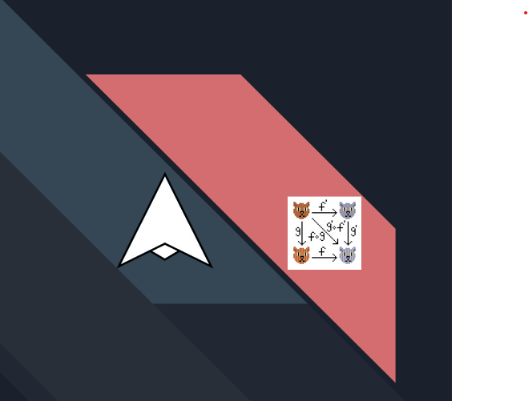

# Scala with Cats & Kotlin with Arrow

A project used to demonstrate and compare [Arrow](https://arrow-kt.io) & Kotlin with [Cats/Effects](https://typelevel.org/cats-effect/) & Scala(2)

* You can find the slides under `/docs`
* There are three modules
  * `java-stuff` Contains a simple interface and implementation to compare Java interoperability with Scala and Kotlin
  * `scala-stuff` Contains examples for the following topics
    * `Interoperability`
      *  [`Interoperability.scala`](scala-stuff/src/main/scala/io/github/flyingcowmoomoo/arrowcatsfpguild/scala/Effects.scala)
    * `Pattern Matching`
      *  [`PatternMatching.scala`](scala-stuff/src/main/scala/io/github/flyingcowmoomoo/arrowcatsfpguild/scala/PatternMatching.scala)
    * `Effects`
      * [`EffectsSimple.scala`](scala-stuff/src/main/scala/io/github/flyingcowmoomoo/arrowcatsfpguild/scala/EffectsSimple.scala)
      * [`Effects.scala`](scala-stuff/src/main/scala/io/github/flyingcowmoomoo/arrowcatsfpguild/scala/Effects.scala)
  * `kotlin-stuff` Contains examples for the following topics
      * `Interoperability`
          *  [`Interoperability.kt`](kotlin-stuff/src/main/kotlin/io/github/flyingcowmoomoo/kotlin/arrowcatsfpguild/Interoperability.kt)
      * `Pattern Matching`
          *  [`PatternMatching.kt`](kotlin-stuff/src/main/kotlin/io/github/flyingcowmoomoo/kotlin/arrowcatsfpguild/PatternMatching.kt)
      * `Effects`
          * [`EffectsSimple.kt`](kotlin-stuff/src/main/kotlin/io/github/flyingcowmoomoo/kotlin/arrowcatsfpguild/EffectsSimple.kt)
          * [`Effects.kt`](kotlin-stuff/src/main/kotlin/io/github/flyingcowmoomoo/kotlin/arrowcatsfpguild/Effects.kt)

* Gradle has been used as the build tool for the project and every module
* For more information see
  * Arrow: https://arrow-kt.io/
  * Cats Effect: https://typelevel.org/cats-effect/